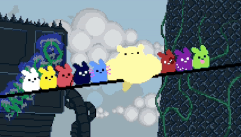
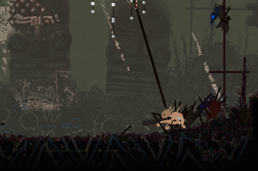

##  &nbsp;Olá! Me chamo Gabriel!!

Sou um desenvolvedor curioso e motivado procurando desenvolvimento pessoal.

- 📖 &nbsp;Estudando **Análise e Desenvolvimento de Sistemas** na Uninter.
- 🖥️ &nbsp;Aprendendo **Rust**.
- 🔭 &nbsp;Atualmente trabalho como **Assessor de Tecnologia** no **Banco do Brasil**.
- 🎮 &nbsp;No tempo livre costumo jogar, testar programas e aplicativos, ouvir música e praticar desenho.

### 🖥️ &nbsp;Workspace

#### Linguagens

##

#### IDEs e Editores de Texto

##

### 👨🏽‍💻&nbsp;Mais sobre mim

- 💡 &nbsp;Me empolgo ao testar tecnologias e linguagens.
- 🍜 &nbsp;Minhas comidas favoritas são **Poke e Sorvete**.
- 🖥️ &nbsp;Minha linguagem de programação favorita (atualmente) é **Rust**.
- 🎮 &nbsp;Meus jogos favoritos são **The Binding of Isaac e Rain World**.
- 🎶 &nbsp;Meus artistas favoritos são **Ren, SOAD e Twenty One Pilots**. 

 

##

### 📫 &nbsp;Entre em contato comigo

